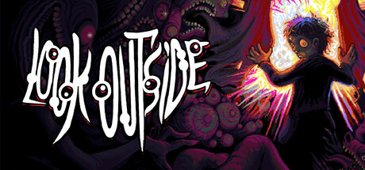
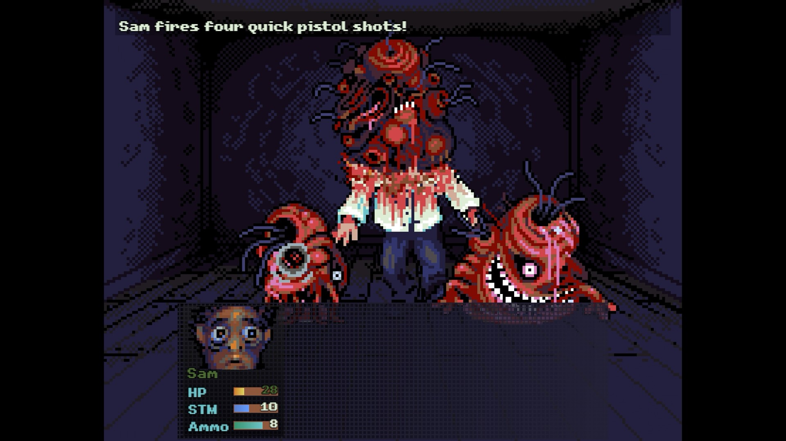
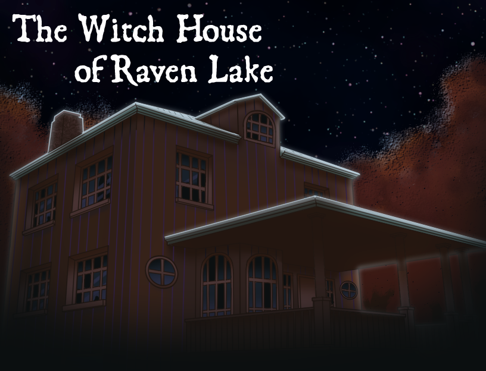
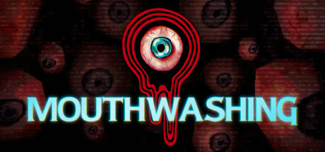
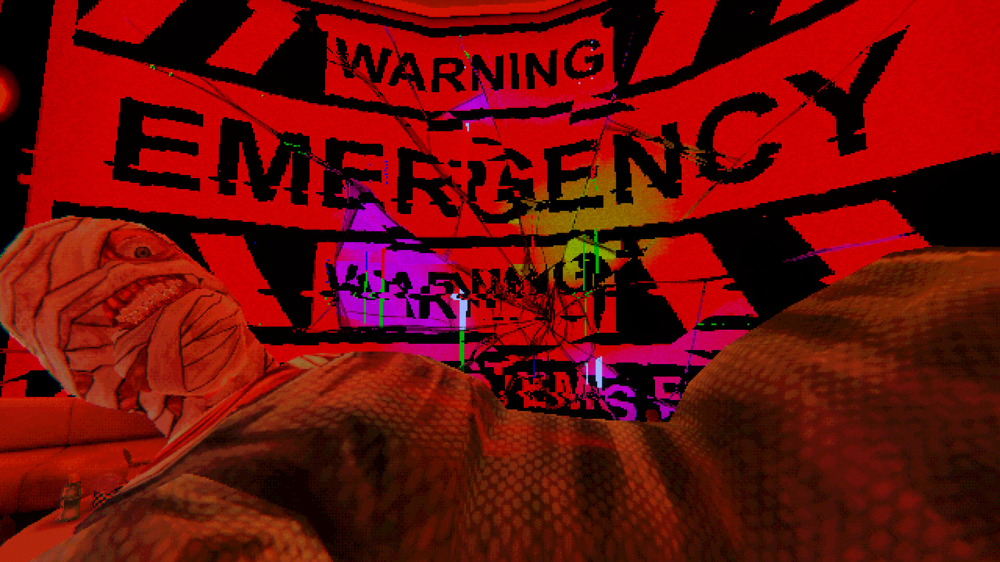
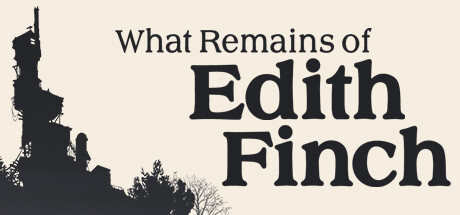
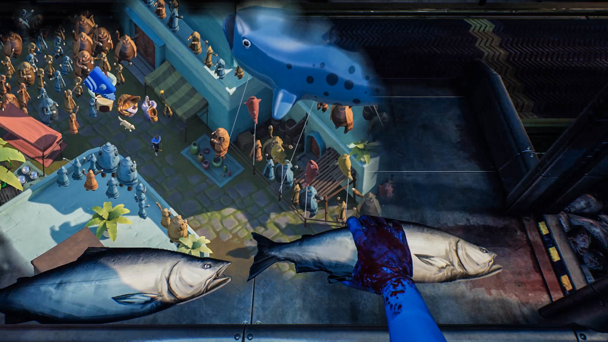
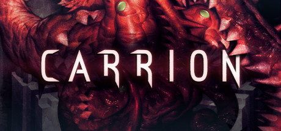
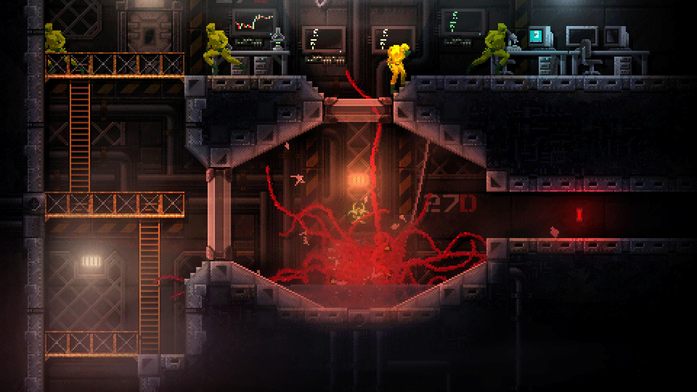

# 🎃 Hawktober Horrors 2026 · 队友指南

> 由 HawkZombie 主办的第 9 届「恐怖游戏 Game Jam」。每年以万圣节为核心，今年回归了**设定主题**。本文给全队看：规则汇总 + 能做什么/不能做什么 + 提交与组队 + 参考游戏（含真实截图）+ 需团队内部定夺的事项。

---

## 1. 关键信息速览

| 项目 | 内容 |
|---|---|
| 主办方 | HawkZombie（Twitch 主播），第 9 届 |
| 标签 | #HawktoberHorrors |
| 开放投稿 | 2026-09-01 起 |
| **截稿** | **2026-10-03 13:59（太平洋时间）** ⚠️ 需换算当地时区 |
| 公布结果 | 2026-11-01（周日）Twitch 直播 |
| 类型限制 | **必须是恐怖游戏**（引擎/代码任意） |
| 游玩时长 | 1–60 分钟 |
| 发行方式 | Windows 可运行，或浏览器 HTML |
| 主题 | 破碎的故事 / 不可靠叙述 |
| 已有数据 | 1,012 人已加入 · 30 个作品 |

> ⏰ **时区提醒**：截稿写的是太平洋时间，务必提前换算，并把「内部死线」设在**提前 1 天**。

---

## 2. 时间线

- **09-01** 开放投稿（开发正式开始；概念可提前，但不能拿旧作品交）
- **10-03 13:59** 截稿（建议提前 3 天先交可玩版，之后可继续更新）
- **11-01** Twitch 直播公布结果；若投稿量大，投票期可能延长

---

## 3. 本届主题：破碎的故事 / 不可靠叙述

一个故事没讲全、被隐瞒、被偏袒某一方；或叙述者不可信；或多视角各执一词。**「不知道该信什么」的不确定感，正是恐怖的核心。**

四个切口：**逆序/回忆倒放 · 多视角互相矛盾 · 叙述者不可信 · 只给一半信息**。

官方参考作品：Memento · Dark Souls · Mouthwashing · Rashomon · Pulp Fiction · Bioshock

---

## 4. 加分「调味料」（非必须，用越多越容易被记住）

- [ ] HawkZombie 作为角色/客串
- [ ] 全员都是经典恐怖套路角色（Jock、Final Girl、Nerd 等）
- [ ] 围绕某个重要节日
- [ ] 整个游戏在**一个房间**
- [ ] **无台词**（口头+文字都没有）
- [ ] 某个角色被**救赎**
- [ ] 发生在**公共场合**（会展中心、商场）
- [ ] 完全从**反派视角**讲
- [ ] 所有信息以**谜语**传达
- [ ] 游戏**不超过 10 分钟**

---

## 5. 能做 / 不能做（重点）

### ✅ 可以
- 任意引擎/代码库
- 任意素材，只要**持有合法使用权**
- 可同时参加别的 jam（须为恐怖游戏且遵守本规则）
- 允许开放 **demo**
- 允许**成人内容**（到 Mature/R）：脏话/血腥/暴力/部分裸露，**前提符合 Twitch 政策**
- 允许**组队**，获胜时所有成员都有 Discord 角色
- 投稿期前可做**概念与规划**（但概念不能原样当成品交）
- 可提交**多个作品**，但同一人/队只能拿 People's 或 Judge's 其中之一
- 作品版权归提交者所有

### 🚫 不可以（取消资格）
- **不得使用已有项目**——必须从投稿期开始开发
- **零容忍剥窃/盗用素材**，包括未授权的同人游戏
- **绝对禁止生成式 AI（GenAI）**——最终提交不能有任何 AI 内容
- 必须能 **Windows** 轻松运行（含浏览器 HTML）
- **PDF 等文档不算游戏**
- 超过 **60 分钟**易判「未完成/不认真」
- **18+ NSFW 游戏**不允许（与 Mature/R 有差别）
- 投稿/投票期间**必须免费、人人可玩**
- 主办方有权**随时取消**违规作品，且**不解释**

### 速查表（贴墙用）

| ✅ 可以做 | 🚫 不可以做（红线） |
|---|---|
| 任意引擎 / 素材（须合法授权） | 使用已有项目（必须投稿期内开始做） |
| 同时参加其他 Jam | 盗用 / 剥窃 / 未授权同人素材 |
| 组队（全队都有获奖资格） | 任何生成式 AI 内容 |
| 成人内容到 Mature / R（须符合 Twitch） | 18+ NSFW 内容 |
| 投稿期前做概念与规划 | PDF 等非游戏形式的文档 |
| 提交多个作品（但只能拿一个奖） | 时长超 60 分钟 / 无法在 Windows 运行 |
| 作品版权归提交者所有 | 投票期收费或不可玩 |

> 🚨 **三条保命红线**：① 全程不用任何 AI；② 不用已有项目/不用扒来的素材；③ 别搞 18+。另三件别忘：Windows 可玩、1–60 分钟、投票期免费。

---

## 6. 提交 + 线上组队（我们已线下组好）

### 提交流程（通用 itch.io）
1. 用 itch.io 账号在 jam 页点 `Join this jam`（已加入）。
2. Dashboard → `Create a new project` 建游戏页，上传游戏，价格设为 **Free**。
3. 在项目页找 `Submit to jam`，选本 jam，可附 devlog，提交。
4. 截稿前 3 天先交可玩版，之后更新。
5. 提交前自查：免费 + 可玩 + 1–60 分钟 + Windows 可运行 + 无 AI + 无扒素材。

### 线上组队做法
1. **每个队员都各自**点 `Join this jam`——计入「Joined」，后续发 Discord 角色才认。
2. **只建一个作品页**，由 1 人当主提交人（别各投一个）。
3. 把队员挂上作品页：官方开了 jam 的 Teams 就用它；否则用项目页的**协作/成员**功能添加。
4. 加入 **HawkZombie 官方 Discord**（jam 页底部有链接）。
5. 上传前确定「作品归属 + 成员名单」。

---

## 7. 奖励
- **大众前 5**：CraftPix 一年会员（每队每人一份，最多 5 人，需在 craftpix.net 注册领奖）
- **两项冠军**（People's 总冠军 + Judge's Choice）：The Feathered Dead Discord 专属角色
- **官方宣传**：HawkZombie 选一部最爱的做成 45–60 秒宣传片挂在他频道（去年是 *The Witch House of Raven Lake*）

---

## 8. 同类参考游戏（含真实截图）

> 下列作品的**封面与游戏内截图已下载到本地** `assets/` 目录，可离线查看（每款另多存一张 `_ss2.jpg`）。点链接可去商店页看预告片与更多截图。

### Look Outside

- 本届系列的精神标杆（2024 届最出名），「破碎 / 不可靠」的范例。
- [Steam 商店（含预告片）](https://store.steampowered.com/app/3373660/) · [当年 jam 提交页](https://itch.io/jam/hawktoberhorrors2024/rate/3055092)
- 文件：`look-outside_header.jpg` / `look-outside_ss1.jpg`

### The Witch House of Raven Lake

- 去年被选为官方宣传片的作品，气氛营造值得学。
- [itch.io 作品页](https://itch.io/jam/hawktoberhorrors2025/rate/3918555) · [去年 jam 主页](https://itch.io/jam/hawktoberhorrors2025)
- 文件：`witch-house-cover.png`

### Mouthwashing（付费）

- 主题描述里点名的神作：碎片化 + 不可靠叙述教科书。
- [Steam 商店（含预告片）](https://store.steampowered.com/app/2475490/)
- 文件：`mouthwashing_header.jpg` / `mouthwashing_ss1.jpg`

### What Remains of Edith Finch

- 每段记忆一种玩法——学「多视角 / 口述记忆怎么落地」。
- [Steam 商店（含预告片）](https://store.steampowered.com/app/501300/)
- 文件：`edith-finch_header.jpg` / `edith-finch_ss1.jpg`

### Carrion（你扮演怪物）

- 「反派视角」的标杆。
- [Steam 商店（含预告片）](https://store.steampowered.com/app/953490/)
- 文件：`carrion_header.jpg` / `carrion_ss1.jpg`

### 历届获奖参考
- 翻去年「故事与写作类」获奖名单，看大家怎么答「破碎故事」的题。
- [2025 故事与写作获奖页](https://itch.io/jam/hawktoberhorrors2025/results/story-and-writing)

> 截图取自各作 Steam 商店页与 itch.io 作品页，已下载到本地 `assets/`；Dark Souls / Bioshock 属环境叙事参考，无独立截图。

---

## 9. 免费素材来源（无 AI 前提下）
| 素材 | 来源 | 说明 |
|---|---|---|
| 2D 道具/UI/音效 | Kenney（kenney.nl） | 全 CC0，最佳保底 |
| 音效 | Freesound、OpenGameArt | 优先 CC0/可商用授权 |
| 字体 | Kenney 字体、Google Fonts（OFL） | 免费可商用 |
| 自绘素材 | 团队手绘 | 按需要少量自绘，避免依赖 AI 生成 |

---

## 10. 初步排期（假设剩 ~3 周，可调整）
| 阶段 | 目标 | 产出 |
|---|---|---|
| D1–D2 | 锁玩法 + 剧本大纲 + 分工 | 故事板、分工表 |
| D3–D4 | **技术原型**：先验证最难的技术点是否可行 | 可跑的原型 demo |
| D5–D8 | 核心系统 + 剧本/内容细化 | 系统可跑、脚本定稿 |
| D9–D12 | 内容填充（关卡/美术/文本） | 规则内完整版 |
| D13–D14 | 音效/氛围/音乐 | 恐怖氛围到位 |
| D15–D16 | 打磨 + 多人试玩 | 修复清单 |
| D17–D19 | 提交准备：游戏页/截图/devlog/导出 | 发布页面 |
| D20–D21 | 缓冲 + 提交（提前 3 天） | 正式提交 |

---

## 11. 提交前自查清单
- [ ] 是恐怖游戏
- [ ] 时长 1–60 分钟
- [ ] Windows 可运行或浏览器 HTML 可玩
- [ ] 投稿期内才开发（没拿旧项目）
- [ ] 素材合法授权（无剥窃/无未授权同人）
- [ ] 全程无任何 AI 内容
- [ ] 投票期免费、人人可玩
- [ ] 已在 10-03 13:59（当地时区）前提交
- [ ] 游戏页挂好全队成员，且每个人 Join 了 jam
- [ ] 已加入 HawkZombie 的 Discord

---

## 12. 需要团队内部定夺的事项

> 以下事项**由团队内部决定**，本文档只列题目、不提供倾向性建议。

1. **玩法方向**：做什么类型的恐怖游戏、核心玩法是什么。
2. **美术风格**：整体视觉方向与素材策略。
3. **引擎与技术选型**：使用什么引擎 / 代码库。
4. **分工**：剧本 / 程序 / 音效 / 上架与截图，各由谁负责。
5. **时区**：换算截稿时间，定内部死线。
6. **账户与归属**：谁有 itch.io 账号可做主提交人（需能操作发布页）。
7. **沟通渠道**：哪个 Discord / 群 / 仓库，素材怎么放。

---

*本指南由助手根据官方页面与公开信息整理，发布与规则如有变动，以 itch.io 官方页面为准。*
